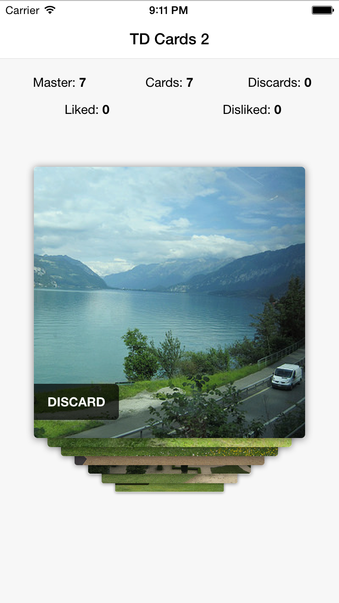

Ionic Contrib: Tinder Cards 2
===================

This is an extension of [Tinder Cards](https://github.com/driftyco/ionic-ion-tinder-cards)
which itself was an extension of [Swipe Cards](https://github.com/driftyco/ionic-ion-swipe-cards),
both created by the driftyco team. The same core directive remains with some additional functionality and a different card layering appearance.

[Demo](http://codepen.io/loringdodge/pen/BNmRrK)



## Install

`bower install ionic-tinder-cards-2`

## Usage

Include `ionic.tdcards2.js`, `collide.js` and `ionic.tdcards2.css` after the rest of your Ionic and Angular includes. Add `ionic.contrib.ui.tinderCards2` as a module dependency of your app. Then use the following AngularJS directives:

```html
<td-cards>
  <td-card ng-repeat="card in cards.active" on-destroy="cardDestroyed($index)" on-swipe-left="cardSwipedLeft($index)" on-swipe-right="cardSwipedRight($index)">
    // Card content here
    <div class="discard" ng-click="onClickTransitionOut(card)">DISCARD</div>
  </td-card>
  <td-card id="end-card" drag="false">
    <i class="icon ion-ios-refresh" ng-click="refreshCards()"></i>
  </td-card>
</td-cards>

```

To add new cards dynamically, just add them to the cards array:

```javascript
.controller('CardsCtrl', function($scope, TDCardDelegate, $timeout) {

  var cards = [
    { // card 1 },
    { // card 2 },
    { // card 3 },
    { // card 4 },
    { // card 5 },
    { // card 6 },
    { // card 7 }
  ];


  $scope.cards = {
    // Master - cards that haven't been discarded
    master: Array.prototype.slice.call(cards, 0),
    // Active - cards displayed on screen
    active: Array.prototype.slice.call(cards, 0),
    // Discards - cards that have been discarded
    discards: [],
    // Liked - cards that have been liked
    liked: [],
    // Disliked - cards that have disliked
    disliked: []
  }

  // Removes a card from cards.active
  $scope.cardDestroyed = function(index) {
    $scope.cards.active.splice(index, 1);
  };

  // Adds a card to cards.active
  $scope.addCard = function() {
    var newCard = cardTypes[0];
    $scope.cards.active.push(angular.extend({}, newCard));
  }

  // Triggers a refresh of all cards that have not been discarded
  $scope.refreshCards = function() {
    // First set $scope.cards to null so that directive reloads
    $scope.cards.active = null;
    // Then set cards.active to a new copy of cards.master
    $timeout(function() {
      $scope.cards.active = Array.prototype.slice.call($scope.cards.master, 0);
    });
  }

  // Listens for the 'removeCard' event emitted from within the directive
  //  - triggered by the onClickTransitionOut click event
  $scope.$on('removeCard', function(event, element, card) {
    var discarded = $scope.cards.master.splice($scope.cards.master.indexOf(card), 1);
    $scope.cards.discards.push(discarded);
  });

  // On swipe left
  $scope.cardSwipedLeft = function(index) {
    var card = $scope.cards.active[index];
    $scope.cards.disliked.push(card);
  };

  // On swipe right
  $scope.cardSwipedRight = function(index) {
    var card = $scope.cards.active[index];
    $scope.cards.liked.push(card);
  };

})
```

## Directive Attributes

| Name                | Scope  | Options    | Action                                                        |
|---------------------|--------|------------|---------------------------------------------------------------|
| `drag`              | @      | true/false | Whether the card can be dragged                               |
| `beforeShow`        | &      | fn         | On creation of card - before being shown on screen            |
| `onSwipeLeft`       | &      | fn         | On swipping to the left - after onTransitionLeft              |
| `onSwipeRight`      | &      | fn         | On swipping to the right - after onTransitionRight            |
| `onTransitionLeft`  | &      | fn         | On transitioning to the left                                  |
| `onTransitionRight` | &      | fn         | On transitioning to the right                                 |
| `onTransitionOut`   | &      | fn         | On successful swipe of card                                   |
| `onPartialSwipe`    | &      | fn         | On partially swipping card |                                  |
| `onSnapBack`        | &      | fn         | On snapping back to original position - after onPartialSwipe  |
| `onDestroy`         | &      | fn         | On destroying of card - after onTransitionOut                 |

## Issues

Currently, callbacks passed as directive attributes only work correctly if placed in CardsCtrl. It will not perform as expected if placed in CardCtrl.
